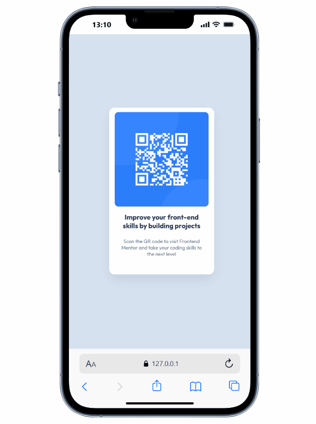

# QR Code Component Main

Este projeto é um componente de QR Code desenvolvido como desafio do Frontend Mentor. Ele utiliza HTML e CSS para criar um cartão centralizado com um QR Code, título e descrição, seguindo boas práticas de responsividade e design, com o objetivo de ter uma boa responsividade.

´´´´
## Visualização do Projeto

## Como visualizar

1. Clone ou baixe este repositório.
2. Abra o arquivo `index.html` em seu navegador.

## Tecnologias Utilizadas

- HTML5
- CSS3
- Fonte [Outfit](https://github.com/Outfitio/Outfit-Fonts) (licença SIL Open Font License 1.1)

## Licença da Fonte

A fonte Outfit utilizada neste projeto está licenciada sob a [SIL Open Font License 1.1](src/outfit/OFL.txt).

## Créditos

Desenvolvido como parte de um desafio do [Frontend Mentor](https://www.frontendmentor.io/).

---

> Sinta-se à vontade para customizar este componente e utilizá-lo em seus projetos!